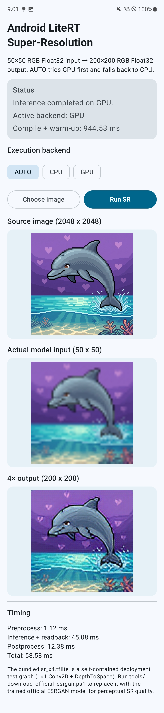
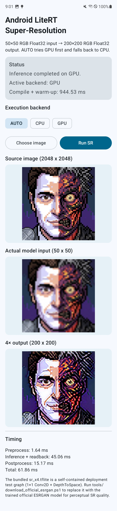

# Android LiteRT Super-Resolution Demo

[한국어 README](README_KOR.md)

An Android demo that runs a **4× image super-resolution TFLite model on-device** using Google's **LiteRT `CompiledModel` API**.

The app converts a selected Android `Bitmap` into an RGB `Float32` tensor, executes the model on **GPU or CPU**, reads the output tensor back, and renders the 4× result in Jetpack Compose.

> **Important model note**
>
> The repository includes `app/src/main/assets/sr_x4.tflite` so the full Android inference pipeline works immediately without downloading a model. The bundled model is a **deployment test graph**, not the trained ESRGAN network. It has the same 50×50 → 200×200 x4 interface and is intended to validate model loading, tensor I/O, GPU/CPU execution, and rendering. Use the provided download script to replace it with the official ESRGAN TFLite model when perceptual SR quality is required.

---

## Demo

### Example 1



Measured on the test device:

| Stage | Time |
|---|---:|
| Backend | GPU |
| Compile + warm-up | 944.53 ms |
| Preprocess | 1.12 ms |
| Inference + readback | 45.08 ms |
| Postprocess | 12.38 ms |
| **Total per image** | **58.58 ms** |

### Example 2



Measured on the same test device:

| Stage | Time |
|---|---:|
| Backend | GPU |
| Compile + warm-up | 944.53 ms |
| Preprocess | 1.64 ms |
| Inference + readback | 45.06 ms |
| Postprocess | 15.17 ms |
| **Total per image** | **61.86 ms** |

The initialization cost is shown separately because model compilation/warm-up happens before per-image inference. Runtime measurements can vary by device, thermal state, GPU driver, image content, and model.

---

## Inference Pipeline

```text
Source image (Bitmap)
        |
        v
Center crop + resize to 50 x 50
        |
        v
RGB Float32 tensor
[1, 50, 50, 3]
        |
        v
TensorBuffer.writeFloat()
        |
        v
LiteRT CompiledModel
        |
        |  model.run(...)
        v
GPU / CPU inference
        |
        v
Output Float32 tensor
[1, 200, 200, 3]
        |
        v
TensorBuffer.readFloat()
        |
        v
RGB Float32 -> ARGB_8888 Bitmap
        |
        v
200 x 200 output image
```

The model contract used by this demo is:

- Input: `Float32 [1, 50, 50, 3]`
- Output: `Float32 [1, 200, 200, 3]`
- Layout: NHWC
- Channels: RGB
- Scale: 4×

---

## Core LiteRT Code

The most important code is in `SrRunner.kt`.

### 1. Select the execution backend

```kotlin
val accelerator = when (backend) {
    ExecutionBackend.CPU -> Accelerator.CPU
    ExecutionBackend.GPU -> Accelerator.GPU
}
```

`AUTO` mode tries GPU first and falls back to CPU if GPU model initialization or warm-up fails.

### 2. Load the `.tflite` model

```kotlin
val model = CompiledModel.create(
    assetManager,
    "sr_x4.tflite",
    CompiledModel.Options(accelerator),
    null,
)
```

`CompiledModel.create()` loads the model from the APK assets and prepares it for the selected accelerator.

### 3. Create input/output tensor buffers

```kotlin
val inputBuffers = model.createInputBuffers()
val outputBuffers = model.createOutputBuffers()
```

These buffers are created once and reused across inference calls.

### 4. Write the input tensor

```kotlin
inputBuffers.single().writeFloat(prepared.tensor)
```

The Android `Bitmap` is not passed directly to the model. `BitmapSrCodec` first crops/resizes the image and converts its pixels into an RGB `FloatArray` matching `[1, 50, 50, 3]`.

### 5. Run the ML model

```kotlin
model.run(
    inputBuffers,
    outputBuffers,
)
```

**This is the actual ML inference call.** LiteRT executes the TFLite graph on the selected GPU or CPU backend.

### 6. Read the output tensor

```kotlin
val output = outputBuffers.single().readFloat()
```

The result is an RGB `FloatArray` with the output shape `[1, 200, 200, 3]`. The app then converts it back to an Android `Bitmap`.

So the core inference path is simply:

```kotlin
inputBuffers.single().writeFloat(rgbInput)
model.run(inputBuffers, outputBuffers)
val rgbOutput = outputBuffers.single().readFloat()
```

---

## Model Initialization and Warm-up

The app initializes the model on a dedicated single-thread coroutine dispatcher rather than blocking the UI thread.

```text
AUTO
 |
 +--> try GPU
 |      |
 |      +--> create CompiledModel
 |      +--> create TensorBuffers
 |      +--> warm-up inference
 |      +--> success -> use GPU
 |
 +--> GPU failure -> create/warm-up CPU model
```

Warm-up runs a zero-filled input once before normal inference. This helps detect unsupported operators/backend problems early and validates that the model returns the expected output size.

The UI reports this initialization cost as **Compile + warm-up** separately from per-image inference time.

---

## Bundled Model vs. ESRGAN

### Bundled model

The repository is immediately runnable with:

```text
app/src/main/assets/sr_x4.tflite
```

The bundled model is a small self-contained TFLite deployment test graph:

```text
Float32 [1, 50, 50, 3]
        |
        v
Conv2D 1 x 1, 48 channels
        |
        v
DepthToSpace, block size 4
        |
        v
Float32 [1, 200, 200, 3]
```

It is useful for validating the Android/LiteRT execution pipeline, but it is **not the trained ESRGAN model**.

### Replace with the official ESRGAN TFLite model

The project includes helper scripts that download the official TensorFlow ESRGAN TFLite model and replace the bundled asset while preserving the same file name expected by the Android app.

Windows / Python:

```powershell
py -3 .\tools\download_official_esrgan.py
```

PowerShell:

```powershell
powershell -ExecutionPolicy Bypass -File .\tools\download_official_esrgan.ps1
```

After replacement, rebuild the APK:

```powershell
.\gradlew.bat clean :app:assembleDebug
```

The Android-side LiteRT inference code does not need to change as long as the model keeps the expected input/output contract.

Official TensorFlow super-resolution example:

- https://www.tensorflow.org/lite/models/super_resolution/overview

---

## Main Project Components

### `SrRunner.kt`

Owns the LiteRT runtime lifecycle:

- selects CPU/GPU backend
- creates `CompiledModel`
- creates and reuses input/output `TensorBuffer`s
- performs warm-up
- executes `model.run()`
- reads output tensors
- measures inference/readback latency
- releases LiteRT native resources

### `BitmapSrCodec.kt`

Handles image preprocessing and output conversion:

- center-crops the source image
- resizes to 50×50
- converts Android ARGB pixels to RGB `Float32`
- converts model RGB `Float32` output back to ARGB bitmap pixels

### `ArgbTensorCodec.kt`

Contains low-level RGB/ARGB conversion logic and bounds checking.

### `MainActivity.kt`

Coordinates app lifecycle, image selection, backend initialization, and inference requests.

### `SrScreen.kt`

Jetpack Compose UI that provides:

- `AUTO`, `CPU`, and `GPU` backend selection
- image picker
- SR execution button
- source image preview
- actual 50×50 model input preview
- 200×200 output preview
- compile/warm-up and inference timing

---

## Build Environment

The project was configured with:

- Android Gradle Plugin: `9.3.1`
- Gradle: `9.5.0`
- Kotlin: `2.2.10`
- LiteRT Android: `com.google.ai.edge.litert:litert:2.1.0`
- `compileSdk`: `37`
- `targetSdk`: `36`
- `minSdk`: `26`
- JDK: 17+

Install Android SDK Platform 37 before building.

---

## Build

### Android Studio

1. Open the project root in Android Studio.
2. Let Gradle Sync finish.
3. Select an Android API 26+ physical device or emulator.
4. Run the `app` configuration.
5. Wait for model initialization.
6. Choose an image and press **Run SR**.

### Command line on Windows

```powershell
.\gradlew.bat :app:assembleDebug
```

The debug APK is generated at:

```text
app\build\outputs\apk\debug\app-debug.apk
```

Install it with ADB:

```powershell
& "$env:LOCALAPPDATA\Android\Sdk\platform-tools\adb.exe" install -r `
  .\app\build\outputs\apk\debug\app-debug.apk
```

---

## Verification and Tests

### Static/offline project checks

```powershell
py -3 .\tools\verify_project.py
py -3 .\tools\inspect_tflite.py --verify-sr-contract
```

These checks verify, among other things:

- TFLite `TFL3` identifier
- TFLite schema
- input/output tensor shape
- LiteRT dependency and model asset configuration
- `CompiledModel` / `TensorBuffer` lifecycle usage

### JVM unit test

```powershell
.\gradlew.bat :app:testDebugUnitTest
```

### Android instrumentation test

With a device/emulator connected:

```powershell
.\gradlew.bat :app:connectedDebugAndroidTest
```

The instrumentation test opens the model on Android, performs a real `CompiledModel.run()` call, reads the output, and validates the 50×50 input / 200×200 output path.

---

## Project Structure

```text
.
├── README.md
├── README_KOR.md
├── settings.gradle.kts
├── build.gradle.kts
├── gradle.properties
├── gradlew
├── gradlew.bat
├── docs/
│   └── images/
│       ├── result_dolphin.jpg
│       └── result_cyborg.jpg
├── tools/
│   ├── download_official_esrgan.py
│   ├── download_official_esrgan.ps1
│   ├── download_official_esrgan.sh
│   ├── generate_demo_model.py
│   ├── inspect_tflite.py
│   └── verify_project.py
└── app/
    └── src/
        ├── main/
        │   ├── assets/sr_x4.tflite
        │   └── java/.../
        │       ├── MainActivity.kt
        │       ├── SrUiState.kt
        │       ├── sr/
        │       │   ├── ArgbTensorCodec.kt
        │       │   ├── BitmapSrCodec.kt
        │       │   └── SrRunner.kt
        │       └── ui/SrScreen.kt
        ├── test/
        └── androidTest/
```

---

## References

- LiteRT: https://ai.google.dev/edge/litert
- LiteRT CompiledModel API for Android/Kotlin: https://ai.google.dev/edge/litert/next/android_kotlin
- Google AI Edge LiteRT samples: https://github.com/google-ai-edge/litert-samples
- TensorFlow Lite Super Resolution / ESRGAN example: https://www.tensorflow.org/lite/models/super_resolution/overview
- TensorFlow Android Super Resolution sample: https://github.com/tensorflow/examples/tree/master/lite/examples/super_resolution/android

---

## Notes

This project is intentionally a **Bitmap-based inference baseline**. For real-time video SR, the next step would be to avoid repeated Bitmap/CPU-memory copies and connect decoder output to GPU-friendly buffers/textures before LiteRT inference.
